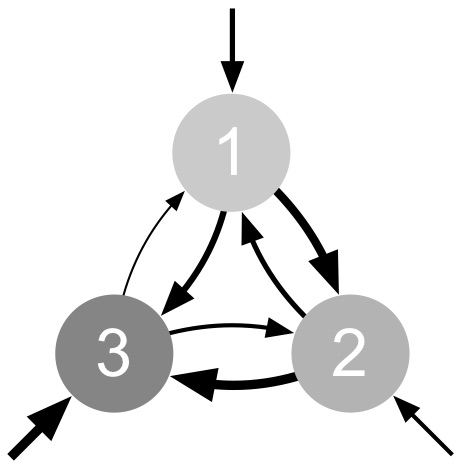

<!-- Main -->

<!-- One -->
<section id="one">
	

		<header class="major">
			<h2>Epistasis</h2>
		</header>
		
Evolutionary causes and consequences of the ways in which genes interact with each other to influence phenotypes.

	

</section>

<!-- Two -->
<section id="two" class="spotlights">
	<section>
		
		

			

				<header class="major">
					<h3>Evolution of sex</h3>
				</header>
				
The vast majority of organisms alive today have experienced some form of genetic exchange, or sex, in their recent evolutionary history, despite substantial costs.

				<ul class="actions">
					<li><a href="generic.html" class="button">Learn more</a></li>
				</ul>
			

		

	</section>
	<section>
		
		

			

				<header class="major">
					<h3>Speciation</h3>
				</header>
				
Genetic incompatibilities can emerge as a byproduct of genetic divergence. According to Dobzhansky and Muller, an allele that fixes in one population may be incompatible with an allele at a different locus in another population when the two alleles are brought together in hybrids.

				<ul class="actions">
					<li><a href="generic.html" class="button">Learn more</a></li>
				</ul>
			

		

	</section>
	<section>
		
		

			

				<header class="major">
					<h3>Evolution of robustness</h3>
				</header>
				
High-order epistasis.

				<ul class="actions">
					<li><a href="generic.html" class="button">Learn more</a></li>
				</ul>
			

		

	</section>
</section>

<!-- Three -->
<section id="three">
	

		<header class="major">
			<h2>Mutation</h2>
		</header>
		
Evolutionary causes and consequences of mutation rate.

		<ul class="actions">
			<li><a href="generic.html" class="button next">Get Started</a></li>
		</ul>
	

</section>

