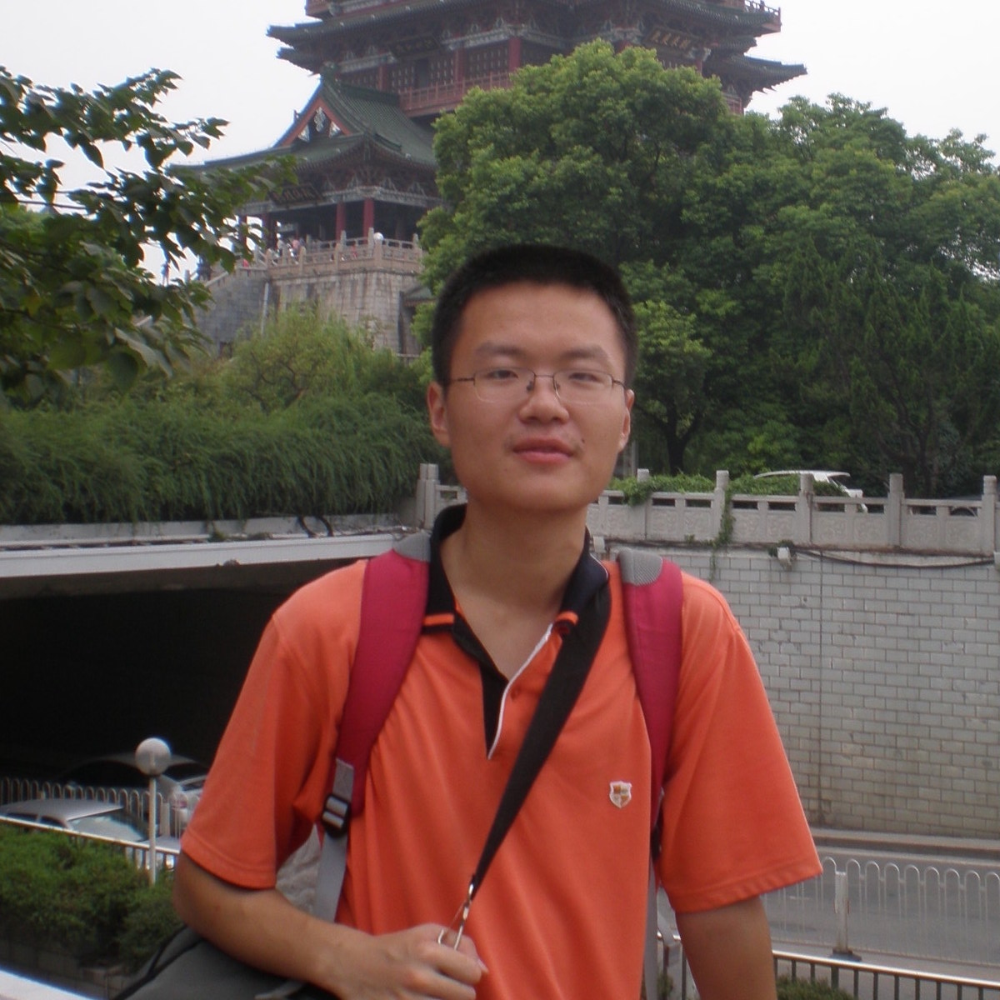

<!-- Main -->

<!-- one -->
<section id="one">
    

        <header class="major">
            <h2>Principal Investigator</h2>
        </header>
    

</section>

<!-- two -->
<section id="two" class="spotlights">
    <section>
        
        

            

                <header class="major">
                    <h3>Ricardo Azevedo, PhD</h3>
                </header>
                
Ricardo Azevedo received a BS in Biology from the University of Lisbon in 1992 and PhD in Evolutionary Biology from the University of Edingburgh in 1997. He is currently an Associate Professor in the <a href="http://www.uh.edu/nsm/biology-biochemistry/">Department of Biology & Biochemistry at the University of Houston</a>.

            

        

    </section>
</section>

<!-- three -->
<section id="three">
    

        <header class="major">
            <h2>Graduate students</h2>
        </header>
    

</section>

<!-- four -->
<section id="four" class="spotlights">
    <section>
        
        

            

                <header class="major">
                    <h3>Logan Chipkin</h3>
                </header>
                
Logan Chipkin received a BA in Physics from the University of Pennsylvania in 2015. He has been a PhD student in the Ecology & Evolution graduate program since 2017, working with Ricardo Azevedo.  Currently, his research projects include (1) modeling <a href="research.html">Muller's Ratchet</a> using branching processes, (2) studying the contribution of mutators to evolutionary rescue, and (3) using phylogenetic comparative methods to test the hypothesis that energy rate density has a tendency to increase during the course of evolution.

            

        

    </section>
    <section>
        
        

            

                <header class="major">
                    <h3>Hao Zhang</h3>
                </header>
                
Hao Zhang received a BS degree in Biology from University of Science and Technology of China in 2011 and an MPhil degree in Life Science from The Hong Kong University of Science and Technology in 2014.  He has been a PhD student in the Ecology & Evolution graduate program since 2015, working with Ricardo Azevedo and Rebecca Zufall on the <a href="research.html">evolutionary success of asexuality</a> in the ciliate <i>Tetrahymena</i>.

            

        

    </section>
    <section>
        
        

            

                <header class="major">
                    <h3>Grimaldo Elias Ureña Matos</h3>
                </header>
                
Elias studied Electrical and Mechanical engineering in the Technological University of Panama. Since 2009, he has been interested in interdisciplinary research on biological systems ranging from modeling energy flux in tropical forest to synthetic biology. In 2014 he joined Azevedo's lab, since then he has been working on how the Lambda phage genetic architecture affects its evolutionary strategies and epidemiological dynamics.

            

        

    </section>
</section>

<!-- five -->
<section id="five">
    

        <header class="major">
            <h2>Undergraduate students</h2>
        </header>
     

<!-- six -->
<section id="six" class="spotlights">
    <section>
        
        

            

                <header class="major">
                    <h3>Robert Laroche</h3>
                </header>
                
Since 2017, Robert Laroche has conducted undergraduate research in Dr. Azevedo’s lab as part of a Senior Honors Thesis exploring a novel, holey version of an NK fitness landscape. He will receive his BS in Biology from the University of Houston in December 2018 and intends to pursue a PhD in evolutionary biology.

            

        

    </section>
    <section>
        
        

            

                <header class="major">
                    <h3>Lydia Golightly</h3>
                </header>
                
Lydia Golightly is an undergraduate at the University of Houston and will graduate in spring 2019 with BSs in Biology and Mathematics. She joined Ricardo Azevedo's group in early 2018 and works on Dobzhansky­–Muller incompatibilities, epistasis, and fitness landscapes. Lydia is also manager of Tony Frankino's lab, where she works on morphological scaling relationships.  She intends to pursue a PhD in evolutionary theory.

            

        

    </section>
</section>
</section>

<!-- seven -->
<section id="seven">
    

        <header class="major">
            <h2>Alumni</h2>
        </header>
     

<!-- eight -->
<section id="eight" class="spotlights">
    <section>
        
        

            

                <header class="major">
                    <h3>Kedar Karkare, PhD</h3>
                </header>
                
Kedar Karkare received his bachelors degree in Biology from the University of North Carolina at Chapel Hill in 2014 and a PhD in Evolutionary Biology from the University of Houston in 2018. During his PhD, he worked with Ricardo Azevedo to improve Fisher's Geometric Model of Adaptation and with Tim Cooper to investigate the evolution of the <i>lac</i> operon in <i>E. coli</i>. He currently works at Mercury Data Science, a data science consulting group based in Houston.

            

        

    </section>    <section>
        
        

            

                <header class="major">
                    <h3>Ata Kalirad, PhD</h3>
                </header>
                
Ata Kalirad received a BS in Cell and Molecular Biology from the University of Tehran in 2011 and a PhD in Evolutionary Biology from the University of Houston in 2016. During his PhD, he worked with Ricardo Azevedo on the <a href="research.html">snowball effect</a>. He has been working as a postdoctoral researcher at the Institute for Research in Fundamental Sciences (<a href="http://www.ipm.ac.ir/">IPM</a>) in Tehran since 2017, focusing on the role of stochasticity in living systems.

            

        

    </section>
    <section>
        
        

            

                <header class="major">
                    <h3>Bingjun Zhang, PhD</h3>
                </header>
                
Bingjun Zhang received a PhD in Evolutionary Biology from the University of Houston in 2016. During her PhD, she worked with Ricardo Azevedo on the <a href="research.html">evolution of mutation rate</a>. She has been working as an independent software engineer in Silicon Valley since 2017.

            

        

    </section>
</section>
</section>

