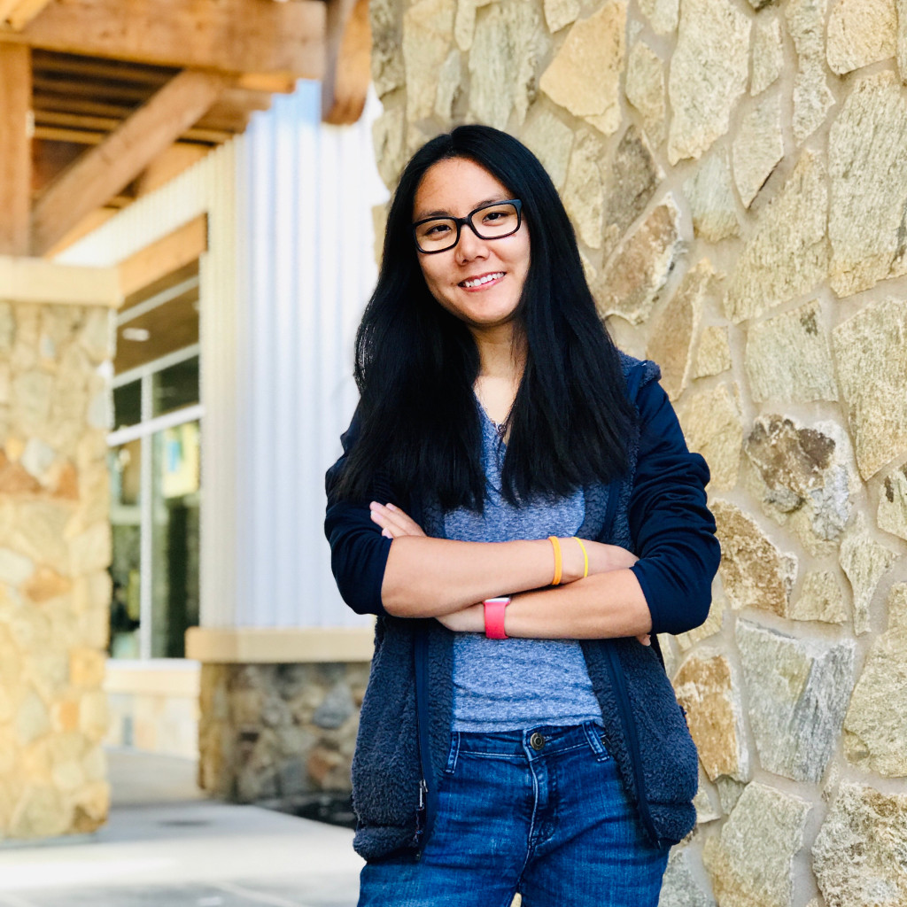

<!-- Main -->

<!-- One -->
<section id="one">
    

        <header class="major">
            <h2>Graduate students</h2>
        </header>
    

</section>

<!-- Two -->
<section id="two" class="spotlights">
    <section>
        
        

            

                <header class="major">
                    <h3>Logan Chipkin</h3>
                </header>
                
Logan Chipkin received his BA in physics from the University of Pennsylvania in 2015. Since 2017, he has been working with Ricardo Azevedo and Peter Olofsson on a model of <a href="research.html">Muller's Ratchet</a>
                based on branching processes.  Currently, his research projects include (1) studying the contribution of mutators to evolutionary rescue and (2) using phylogenetic comparative methods to test the hypothesis that energy rate density has a tendency to increase during the course of evolution.

            

        

    </section>
    <section>
        
        

            

                <header class="major">
                    <h3>Hao Zhang</h3>
                </header>
                
Nullam et orci eu lorem consequat tincidunt vivamus et sagittis magna sed nunc rhoncus condimentum sem. In efficitur ligula tate urna. Maecenas massa sed magna lacinia magna pellentesque lorem ipsum dolor. Nullam et orci eu lorem consequat tincidunt. Vivamus et sagittis tempus.

                <ul class="actions">
                    <li><a href="generic.html" class="button">Learn more</a></li>
                </ul>
            

        

    </section>
    <section>
        
        

            

                <header class="major">
                    <h3>Grimaldo Elias Ureña Matos</h3>
                </header>
                
Nullam et orci eu lorem consequat tincidunt vivamus et sagittis magna sed nunc rhoncus condimentum sem. In efficitur ligula tate urna. Maecenas massa sed magna lacinia magna pellentesque lorem ipsum dolor. Nullam et orci eu lorem consequat tincidunt. Vivamus et sagittis tempus.

                <ul class="actions">
                    <li><a href="generic.html" class="button">Learn more</a></li>
                </ul>
            

        

    </section>
</section>

<!-- Three -->
<section id="three">
    

        <header class="major">
            <h2>Undergraduate students</h2>
        </header>
     

<!-- Four -->
<section id="four" class="spotlights">
    <section>
        
        

            

                <header class="major">
                    <h3>Robert Laroche</h3>
                </header>
                
Nullam et orci eu lorem consequat tincidunt vivamus et sagittis magna sed nunc rhoncus condimentum sem. In efficitur ligula tate urna. Maecenas massa sed magna lacinia magna pellentesque lorem ipsum dolor. Nullam et orci eu lorem consequat tincidunt. Vivamus et sagittis tempus.

                <ul class="actions">
                    <li><a href="generic.html" class="button">Learn more</a></li>
                </ul>
            

        

    </section>
    <section>
        
        

            

                <header class="major">
                    <h3>Lydia Golightly</h3>
                </header>
                
Nullam et orci eu lorem consequat tincidunt vivamus et sagittis magna sed nunc rhoncus condimentum sem. In efficitur ligula tate urna. Maecenas massa sed magna lacinia magna pellentesque lorem ipsum dolor. Nullam et orci eu lorem consequat tincidunt. Vivamus et sagittis tempus.

                <ul class="actions">
                    <li><a href="generic.html" class="button">Learn more</a></li>
                </ul>
            

        

    </section>
</section>
</section>

<!-- Four -->
<section id="four">
    

        <header class="major">
            <h2>Alumni</h2>
        </header>
     

<!-- Four -->
<section id="four" class="spotlights">
    <section>
        
        

            

                <header class="major">
                    <h3>Ata Kalirad, PhD</h3>
                </header>
                
Ata Kalirad received his BS in cell and molecular biology from the University of Tehran in 2011 and his PhD in evolutionary biology from the University of Houston in 2016. During his PhD, he worked with Ricardo Azevedo on the <a href="research.html">snowball effect</a>. He has been working as a postdoctoral researcher at the Institute for Research in Fundamental Sciences (<a href="http://www.ipm.ac.ir/">IPM</a>) in Tehran since 2017, focusing on the role of stochasticity in living systems.

            

        

    </section>
    <section>
        
        

            

                <header class="major">
                    <h3>Bingjun Zhang, PhD</h3>
                </header>
                
Bingjun Zhang received her PhD in evolutionary biology from the University of Houston in 2016. During her PhD, she worked with Ricardo Azevedo on the <a href="research.html">evolution of mutation rate</a>. She has been working as an independent software engineer in Silicon Valley since 2017.

            

        

    </section>
</section>
</section>

